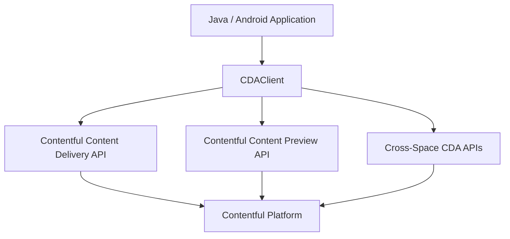

<!-- Generated by seed-golden-context | Last updated: 2026-05-11 -->

# Architecture

## Overview

`contentful.java` is the official Java SDK for Contentful's Content Delivery API (CDA) and Content Preview API (CPA). It is a pure-Java library (ships as a JAR) that wraps the Contentful HTTP APIs in an idiomatic Java client, providing automatic link resolution, locale fallback, rich text parsing, sync, and optional reactive (RxJava 3) access patterns.

## System Context

Consumers are JVM and Android applications. The SDK wraps all outbound HTTP via OkHttp + Retrofit and returns parsed, link-resolved Java objects. No server-side component; no persistent store.

## Internal Structure

| Package / Directory | Purpose |
|---|---|
| `com.contentful.java.cda` | Root package — `CDAClient`, query builders, resource model classes, sync, serialization |
| `com.contentful.java.cda.interceptor` | OkHttp interceptors: auth header, user-agent, error translation, logging |
| `com.contentful.java.cda.rich` | Rich Text node model (`CDARichDocument`, `CDARichParagraph`, etc.) and `RichTextFactory` |
| `com.contentful.java.cda.image` | `ImageOption` helper for Images API URL construction |
| `src/main/resources/…/build` | Build-time generated `GeneratedBuildParameters.java` (injects SDK version) |
| `src/test/java/…/cda` | Unit + mock-server tests mirroring the main package |
| `src/test/java/…/cda/integration` | Integration tests against live Contentful environments |
| `src/test/resources/` | Canned JSON fixtures used by mock-server tests |
| `.devcontainer/` | Reproducible dev environment (eclipse-temurin JDK on Ubuntu Jammy) |
| `.github/workflows/` | CI pipeline (runs tests inside the devcontainer) |

## Data Flow

1. **Client construction** — `CDAClient.builder()` configures space, token, environment, optional preview mode, cross-space tokens, and HTTP client settings. Retrofit is built with a Gson converter factory and a RxJava3 call adapter factory. OkHttp interceptors inject the `Authorization` header, the `X-Contentful-User-Agent` header, and error/logging behavior.

2. **Query execution** — `CDAClient.fetch(Type.class)` returns an `AbsQuery` (or `FetchQuery`) that builds a URL and dispatches via `CDAService` (a Retrofit interface). Calls can be synchronous (`.all()`, `.one()`), callback-based (`CDACallback`), or reactive (`.observe()`/`RxJava Flowable`).

3. **Deserialization** — Gson deserializes the raw JSON response into `CDAArray`. `ResourceDeserializer` dispatches each item to the concrete `CDAResource` subclass based on the `sys.type` field.

4. **Post-processing** — `ResourceFactory.array()` orchestrates:
   - `ResourceUtils.localizeResources()` — applies locale fallback chain from the space's locale list
   - `ResourceUtils.mapResources()` — indexes assets and entries by ID
   - `ResourceUtils.setRawFields()` — preserves the unprocessed field map for rich text access
   - `RichTextFactory.resolveRichTextField()` — parses rich text JSON into the `CDARich*` node tree
   - `ResourceUtils.resolveLinks()` — traverses the includes and replaces link stubs with the actual `CDAResource` objects (in-memory object graph)

5. **Result** — `CDAArray` (or single `CDAResource`) is returned to the caller with fully resolved links and localized fields.

6. **Sync path** — `CDAClient.sync()` uses `SyncQuery` and `SynchronizedSpace`. Subsequent sync calls pass the token from the prior `SynchronizedSpace` to fetch only the delta. Deleted resources appear in `deletedEntries()` / `deletedAssets()` sets.

## Key Dependencies

| Dependency | Version | Why it's here |
|---|---|---|
| `retrofit2` | 2.11.0 | HTTP client abstraction — declarative API definition via `CDAService` interface |
| `okhttp3` / `okhttp-jvm` | 5.1.0 | Underlying HTTP engine; customizable via `defaultCallFactoryBuilder()` |
| `rxjava3` | 3.1.9 | Optional reactive access pattern via `.observe()` |
| `adapter-rxjava3` | 2.11.0 | Retrofit adapter bridging Retrofit `Call` to RxJava3 `Flowable` |
| `converter-gson` | 2.11.0 | JSON deserialization via Gson |
| `gson` | 2.11.0 | Core JSON parsing; custom `ResourceDeserializer` registered for polymorphic types |
| `named-regexp` | 0.2.5 | Named capture group support used in locale/link processing |
| `android` (optional) | 4.1.1.4 | Platform detection for callback executor (main thread on Android, background thread on JVM) |
| `junit 4` | 4.13.1 | Test framework |
| `mockwebserver` | 5.1.0 | Local OkHttp mock server for unit tests |
| `mockito-core` | 2.23.4 | Mocking framework |
| `truth` | 0.42 | Fluent test assertions |

See [ADR 0002](./docs/ADRs/0002-retrofit-okhttp-as-http-layer.md) and [ADR 0003](./docs/ADRs/0003-rxjava3-reactive-access.md) for rationale on key dependency choices.

## Configuration

| Builder Method / Flag | Purpose | Default |
|---|---|---|
| `.setSpace(id)` | Contentful Space ID | Required |
| `.setToken(token)` | CDA or CPA access token | Required |
| `.setEnvironment(id)` | Environment ID | `master` |
| `.preview()` | Switches base URL to Content Preview API | `false` (CDA) |
| `.setCrossSpaceTokens(map)` | Tokens for additional spaces (max 20) | `null` (disabled) |
| `.setCallFactory(factory)` | Replace the underlying OkHttpClient | Auto-configured |
| `.defaultCallFactoryBuilder()` | Returns a pre-configured `OkHttpClient.Builder` for customization | — |
| `.setLogger(logger)` | Custom `Logger` implementation | `null` |
| `.setLogLevel(level)` | Verbosity of HTTP logs | `NONE` |
| `.logSensitiveData(bool)` | Whether to log auth header values | `false` |
| `.setCallbackExecutor(executor)` | Executor for async callbacks | Platform default (main thread on Android) |

## Integration Points

### Upstream (this repo consumes)
- **Contentful Content Delivery API** — `https://cdn.contentful.com` — primary data source
- **Contentful Content Preview API** — `https://preview.contentful.com` — preview (unpublished) content

### Downstream (consumes this repo)
- **Java / Kotlin server applications** — backend content rendering, import pipelines
- **Android applications** — content delivery on mobile (minimum Android API 21 / Java 8)
- **`rich-text-renderer-java`** — companion library that consumes the `CDARich*` node model from this SDK to render rich text

## Android Specifics

The library is distributed as a JAR (not AAR). It uses `android.os.Handler` and `android.os.Looper` (in `Platform.java`) for main-thread callback delivery on Android — both are stable public APIs. The `TlsSocketFactory` is only activated below Android API 20; on modern Android the system TLS defaults are used.

OkHttp 5 splits platform artifacts: JVM users get `okhttp-jvm` (included by default). Android apps should depend on `okhttp-android` and exclude `okhttp-jvm` to avoid duplicate-class errors. See README for Gradle snippet.

## Release & Distribution

- **Registry**: Maven Central (via Sonatype Central Publishing plugin), `groupId: com.contentful.java`, `artifactId: java-sdk`
- **Pre-release**: Sonatype snapshots and jitpack.io
- **Versioning**: Semantic Versioning — patch = bug fixes / dependency updates; minor = new non-breaking features; major = breaking API changes
- **Branching**: Trunk-based development off `master`
- **Release cadence**: On-demand
- **Build**: Maven Wrapper (`./mvnw`) — no global Maven installation required
- **Code coverage**: Codecov
- **Checkstyle**: Enforced at `verify` phase via `checkstyle.xml`
- **GPG signing**: Required for Maven Central publication (private key managed by Contentful infrastructure team)

See [CONTRIBUTING.md](./CONTRIBUTING.md) for the full release procedure.
