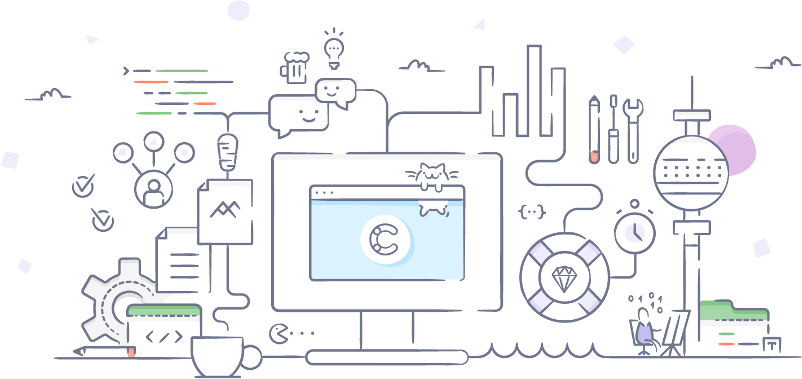

<p align="center">
  <br/>

  <a href="https://www.contentful.com/slack/">
    
  </a>
  &nbsp;
  <a href="https://www.contentfulcommunity.com/">
    
  </a>
</p>

contentful.java - Contentful Java Delivery SDK
==============================================
[](https://travis-ci.org/contentful/contentful.java/builds#)
[](https://codecov.io/gh/contentful/contentful.java)

> Java SDK for [Content Delivery API](https://www.contentful.com/developers/docs/references/content-delivery-api/) and [Content Preview API](https://www.contentful.com/developers/docs/references/content-preview-api/). It helps in easily accessing the content stored in Contentful using Java applications.


What is Contentful?
-------------------
[Contentful](https://www.contentful.com) provides a content infrastructure for digital teams to power content in websites, apps, and devices. Contentful, unlike any other CMS, is built to integrate with the modern software stack. It offers a central hub for structured content, powerful management and delivery APIs, and a customizable web app that enable developers and content creators to ship digital products faster.

<details open>
<summary>Table of contents</summary>

<!-- TOC -->
- [Core Features](#core-features)
- [Getting Started](#getting-started)
  - [Setup](#setup)
  - [Client Creation](#client-creation)
  - [First Request](#first-request)
- [Usage](#usage)
  - [Filtering](#filtering)
  - [Calls in Parralel](#calls-in-parallel)
  - [Paging](#paging)
  - [Includes](#includes)
  - [Preview Mode](#preview)
  - [Sync](#sync)
  - [Http Client](#http-client)
  - [Proguard](#proguard)
  - [Pre-Releases](#pre-releases)
- [Documentation](#documentation)
- [License](#license)
- [Reaching Contentful](#reaching-contentful)
  - [Bugs and Feature Requests](#bugs-and-feature-requests)
  - [Sharing Confidential Information](#sharing-confidential-information)
  - [Getting involved](#getting-involved)
- [Code of Conduct](#code-of-conduct)

</details>

<!-- /TOC -->

Core Features
=============

- Content retrieval through [Content Delivery API](https://www.contentful.com/developers/docs/references/content-delivery-api/) and [Content Preview API](https://www.contentful.com/developers/docs/references/content-preview-api/).
- [Synchronization](https://www.contentful.com/developers/docs/concepts/sync/)
- [Localization support](https://www.contentful.com/developers/docs/concepts/locales/)
- [Link resolution](https://www.contentful.com/developers/docs/concepts/links/)
- Supports [Environments](https://www.contentful.com/developers/docs/concepts/multiple-environments/)
- Synchronous and asynchrouns methods of fetching content

Getting Started
===============

Setup
-----

Install the Contentful dependency:

* _Maven_
```xml
<dependency>
  <groupId>com.contentful.java</groupId>
  <artifactId>java-sdk</artifactId>
  <version>10.0.0</version>
</dependency>
```

* _Gradle_

```groovy
compile 'com.contentful.java:java-sdk:10.0.0'
```

This SDK requires Java 8 (or higher version) or Android 5.

Client Creation
---------------

The `CDAClient` manages all interactions with the _Content Delivery API_.

```java
CDAClient client = CDAClient.builder()
    .setSpace("{space-key-goes-here}")
    .setToken("{access-token-goes-here}")
    .build();
```

The <a href="https://www.contentful.com/developers/docs/references/content-delivery-api/#/reference/spaces" title="A Space is a container for all Resources in Contentful."/>_Space_</a>-id and <a href="https://www.contentful.com/developers/docs/references/content-delivery-api/#/introduction/authentication" title="An access token is a password to the content of the Space.">_Access Token_</a> are retrived from the <a href="https://app.contentful.com/deeplink?link=api" title="The Web App is used to edit content visually.">Contentful WebApp</a>.

First Request
-------------

Fetching content is achieved by calling the `CDAClient.fetch()`-method. It fetches all <a href="https://www.contentful.com/developers/docs/references/content-delivery-api/#/introduction/common-resource-attributes" title="Everything stored in Contentful is a Resource."/>_Resources_</a> from a Space. The following code fetches all <a href="https://www.contentful.com/developers/docs/references/content-delivery-api/#/reference/entries" title="An Entry stores content in a user defined structure."/>_Entries_</a>:

```java
// Fetch entries
CDAArray array = 
    client
        .fetch(CDAEntry.class)
        .all();
```

Usage
=====

Filtering
---------

Filtering of Resources can be done by chaining method calls after the `.fetch()`. Using `.one()` and a Resource id retrieves only the specifyied Resource:

```java
CDAEntry entry =
    client
        .fetch(CDAEntry.class)
        .one("{entry-id-goes-here}");
```

Fetching only Entries of a specific <a href="https://www.contentful.com/developers/docs/references/content-delivery-api/#/reference/content-types" title="A ContentType defines the structure of an Entries field."/>_Content Type_</a> is done by adding the `.withContentType({id})` call to the chain:

```java
CDAArray result = 
    client
        .fetch(CDAEntry.class)
        .withContentType("{content-type-id-goes-here}")
        .orderBy("{some-field-id-to-order-by-goes-here}")
        .all();
```

Finally fetching <a href="https://www.contentful.com/developers/docs/references/content-delivery-api/#/reference/assets" title="All external binary data stored in Contentful. Images, videos, pdf, etc"/>_Assets_</a> follows the same principles:

```java
// Fetch an Asset with a specific id
CDAEntry entry =
    client
        .fetch(CDAEntry.class)
        .one("{asset-id-goes-here}");
```

Calls in Parallel
-----------------

All of the above examples are executed synchronously. In order to request asynchronously, provide a callback to `.all(…)` or `.one(…)`:

```java
client
    .fetch(CDAAsset.class)
    .all(new CDACallback<CDAArray>() {
  @Override protected void onSuccess(CDAArray result) {
    // ...
  }
});
```

> Note: The return value for any asynchronous methods is the Callback itself, making sure keeping a reference to it and clearing it according to its host lifecycle events is adviced. 

If <a href="https://github.com/ReactiveX/RxJava" title="a library for composing asynchronous and event-based programs using observable sequences for the Java VM."/>_RxJava_</a> is required instead, the `.observe()` method can be used to get an `Observable` instance:

```java
client
    .observe(CDAAsset.class)
    .one("jake")
    .subscribe(System.out::println);
```

Paging
------

If more then _100_ Resources are in the Space, `.fetchAll()` only returns the first _100_. If more Resources are needed, specify the limit with the `.limit(X)` for example:

```java
CDAArray result = 
  client
    .fetch(CDAEntry.class)
    .limit(1000)
    .all();
```

The maximum number of Resources to be requested is _1000_. 

For more then _1000_ Resources `.skip(N)`, `.limit(L)` and `.orderBy(F)` methods are needed. By using `.skip(N)`, the first _N_ Resources are ignored and _L_, from `.limit(L)`, items are returned. 

To guarantee ordering, the use of the `.orderBy` method is required: It enforces the <a href="https://www.contentful.com/developers/docs/references/content-delivery-api/#/introduction/collection-resources-and-pagination" title="A collection of Resources from Contentful. Containts meta information about number and limits of the Resources it contains."/>_Array_</a> to be in a predictable order. 

The following code is used to request all Entries:

```java
// get the amount of Entries, without fetching the actual content
final int amountOfResourcesInContentful = 
  client
    .fetch(CDAEntry.class)
    .limit(0)
    .all()
    .total();

// create storage for the Entries
final List<CDAResource> resources = new ArrayList<CDAResource>(amountOfResourcesInContentful);

// use page size, based on usecase
final int PAGE_SIZE = 2;

// loop through all pages and store results
for(int page = 0; page * PAGE_SIZE < amountOfResourcesInContentful; ++page) {
  final CDAArray currentPagedItems = client
      .fetch(CDAEntry.class)
      .skip(page * PAGE_SIZE)
      .limit(PAGE_SIZE)
      .orderBy("sys.createdAt")
      .all();

  // add to current list of Entries
  resources.addAll(currentPagedItems.items());
}
```

Using the `.reverseOrderBy()` method reverses the order:

```java
CDAArray result = 
    client
        .fetch(CDAEntry.class)
        .limit(23)
        .reverseOrderBy("sys.createdAt")
        .all();
```

The above snippet will fetch the first _23_ Entries, sorted by creation date with the latest ones on top.

[Sync](#sync) is used to fetch all entries in a single call and to get only changed Resources in following calls.

Includes
--------

The SDK contains a feature called link resolution, which will take a link and resolve them. So there is no need to look through entry id's manually, a simple `.getField(…)` retrieves and entry directly, no need to use the link elements themselves.

For this feature to work, the linked entry needs to be _published_ (see [preview](#preview)) and the include level needs to be set to include this entry. A level of `2` means, that the links of links are getting resolved. Entries of deeper levels contain an empty field if the link could not be resolved. Finding the id of the not resolved field can be achieved through comparing the `.rawFields` with the `.fields` property of an Entry.

In order to change the level of includes, the following snippet can be used as a guide:

```
CDAArray found = client.fetch(CDAEntry.class)
        .include(1) // maximum is 10
        .all();
```

This only resolves the first level of includes. `10` is the maximum number of levels to be included and should be used sparringly, since this will bloat up the response by a lot.

Select
------

The amount of data returned by the API can be reduced by using the `.select()` method on a query. With this, Contentful only returns the selected fields. The SDK enforces that the `sys` fields (`.getAttribute()` on an Entry) will always be returned, since it is used for the proper functioning of the SDK.

If reducing the payload size is wanted, the following snippet can explain how to accomplish that

```
CDAArray found = client.fetch(CDAEntry.class)
    .withContentType("cat");
    .select("fields.name");
```
This snippet makes sure that the entries of type `cat` are only containing its `name` field. All other fields will be `null` or its respective default value. 

> Note: The content type has to be added through `.withContentType(…)` otherwise an error ensues.

Preview
-------

The _Content Delivery API_ only returns _published_ Entries. The <a href="https://www.contentful.com/developers/docs/references/content-preview-api/" title="Shortened to Preview from now on."/>_Content Preview API_</a> will return _all_ Entries, even not published ones:

```java
CDAClient client = 
    CDAClient.builder()
        .setSpace("space-key-goes-here")
        .setToken("access-token-goes-here")
        .preview()
        .build();
```

The <a href="https://www.contentful.com/developers/docs/references/content-preview-api/#/introduction/preview-api-authentication" title="A password for this specific API."/>_Preview Access Token_</a> is exposed on the [Contentful Web App](https://app.contentful.com/deeplink?link=api). 

> Note: In Preview, Resources can be invalid since no validation is performed prior to publishing.

Sync
----

Fetching all Resources and retrieving only changes on subsequent calls is accomplished by using the `.sync()`-methods:

```java
SynchronizedSpace space = client.sync().fetch();
```

The _SynchronizedSpace_ contains _all_ _published_ Resources. If `.preview()` ([see Preview](#preview)) is used, it also contains all unpublished Resources.

If changes are to be fetched later, calling `sync()` again using the given SynchronizedSpace as a parameter is needed:

```java
SynchronizedSpace later = client.sync(space).fetch();
```

If an Entry gets deleted, its <a href="https://www.contentful.com/developers/docs/references/content-delivery-api/#/introduction/common-resource-attributes" title="Every Resource has a unique id."/>_id_</a> is returned in the`SynchronizedSpace.deletedEntries()` set. Same is true for the deleted Assets through `SynchronizedSpace.deletedAssets()`.

Http Client
-----------

Changing the settings of the http client, without losing the information setup in the client build process, is achieved by requesting the `.defaultCallFactoryBuilder()` from the `CDAClient.Builder`, changing it and then reapplying it:

```java
// create a client builder as usual
CDAClient.Builder clientBuilder = CDAClient.builder()
        .setSpace("space-id-goes-here")
        .setEnvironment("environment-id-goes-here")  // optional
        .setToken("cda-token-goes-here");

// request the http client with the settings from above (token, error interceptor, etc)
OkHttpClient httpClient = clientBuilder.defaultCallFactoryBuilder()
        .addInterceptor(interceptor) // adding a custom interceptor
        .connectTimeout(5, TimeUnit.SECONDS) // adding a timeout 
        .cache(new Cache(new File("/tmp"), CACHE_SIZE_BYTES)) // adding a simple http cache
        .build();

// reapply the http changes and build a contentful client
CDAClient cdaClient = clientBuilder.setCallFactory(httpClient).build();
```

Proguard
--------

The [ProGuard configuration file](proguard-cda.cfg) is used to minify Android Apps using this SDK.

Pre-releases
------------

Development versions of this SDK are available through 

* [Sonatype's `snapshots` repository](https://oss.sonatype.org/content/repositories/snapshots/com/contentful/java/java-sdk/):

```groovy
maven { url 'https://oss.sonatype.org/content/repositories/snapshots' }
compile 'com.contentful.java:java-sdk:10.0.0-SNAPSHOT'
```

* [jitpack.io](https://jitpack.io/#contentful/contentful.java/master-SNAPSHOT):

```groovy
maven { url 'https://jitpack.io' }
compile 'com.github.contentful:contentful.java:java-sdk-10.0.0-SNAPSHOT'
```

Documentation
=============

See
* [JavaDoc](https://contentful.github.io/contentful.java/) 
* [API documentation](https://www.contentful.com/developers/documentation/content-delivery-api/)

License
=======

> Copyright (c) 2018 Contentful GmbH. See [LICENSE.txt](LICENSE.txt) for further details.


Reaching Contentful
===================

Questions
---------

* Use the community forum: [](https://support.contentful.com/)
* Use the community slack channel: [](https://www.contentful.com/slack/)

Bugs and Feature Requests
-------------------------

* File an issue here [](https://github.com/contentful/contentful.java/issues/new).

Sharing Confidential Information
--------------------------------

* File a support ticket at our Contentful Customer Support: [](https://www.contentful.com/support/)

Getting involved
----------------

[](http://makeapullrequest.com)

Code of Conduct
===============

Contentful wants to provide a safe, inclusive, welcoming, and harassment-free space and experience for all participants, regardless of gender identity and expression, sexual orientation, disability, physical appearance, socioeconomic status, body size, ethnicity, nationality, level of experience, age, religion (or lack thereof), or other identity markers.

[Full Code of Conduct](https://github.com/contentful-developer-relations/community-code-of-conduct).
