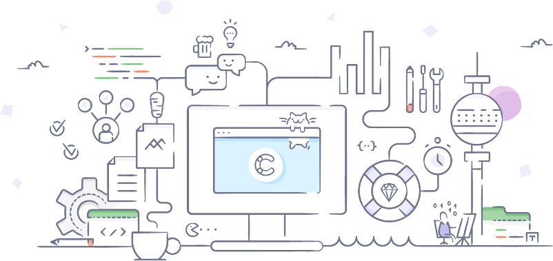

<p align="center">
  
</p>

<p align="center">
  <a href="https://www.contentful.com/slack/">
    
  </a>
  &nbsp;
  <a href="https://www.contentfulcommunity.com/">
    
  </a>
</p>

# contentful.java - Java Content Delivery Library for Contentful

> Java library for the Contentful [Content Delivery API](https://www.contentful.com/developers/docs/references/content-delivery-api/) and [Content Preview API](https://www.contentful.com/developers/docs/references/content-preview-api/). It helps you to easily access your content stored in Contentful with your Java applications.

<p align="center">
  
  &nbsp;
  <a href="LICENSE.txt">
    
  </a>
  &nbsp;
  <a href="https://github.com/contentful/contentful.java/actions/workflows/ci.yml">
    
  </a>
</p>

**What is Contentful?**

[Contentful](https://www.contentful.com/) provides content infrastructure for digital teams to power websites, apps, and devices. Unlike a CMS, Contentful was built to integrate with the modern software stack. It offers a central hub for structured content, powerful management and delivery APIs, and a customizable web app that enable developers and content creators to ship their products faster.

<details open>
<summary>Table of contents</summary>
<!-- TOC -->

- [contentful.java - Java Content Delivery Library for Contentful](#contentfuljava---java-content-delivery-library-for-contentful)
  - [Core Features](#core-features)
  - [Getting started](#getting-started)
    - [Requirements](#requirements)
    - [Installation](#installation)
    - [Your first request](#your-first-request)
    - [Authorization](#authorization)
    - [Accessing the Preview API](#accessing-the-preview-api)
  - [Using the SDK](#using-the-sdk)
    - [Filtering](#filtering)
    - [Calls in parallel](#calls-in-parallel)
    - [Paging](#paging)
    - [Includes](#includes)
    - [Cross-space references](#cross-space-references)
    - [Unwrapping](#unwrapping)
    - [Select](#select)
    - [Synchronization](#synchronization)
    - [Rich text](#rich-text)
  - [Advanced configuration](#advanced-configuration)
    - [Http client](#http-client)
    - [Android and OkHttp 5](#android-and-okhttp-5)
    - [Proguard](#proguard)
  - [Documentation & References](#documentation--references)
    - [Rich Text renderer library](#rich-text-renderer-library)
    - [Pre-releases](#pre-releases)
  - [Reach out to us](#reach-out-to-us)
    - [Have questions about how to use this library?](#have-questions-about-how-to-use-this-library)
    - [You found a bug or want to propose a feature?](#you-found-a-bug-or-want-to-propose-a-feature)
    - [You need to share confidential information or have other questions?](#you-need-to-share-confidential-information-or-have-other-questions)
  - [Get involved](#get-involved)
    - [Development setup](#development-setup)
  - [License](#license)
  - [Code of Conduct](#code-of-conduct)

<!-- /TOC -->

</details>

## Core Features

- Content retrieval through the [Content Delivery API](https://www.contentful.com/developers/docs/references/content-delivery-api/) and [Content Preview API](https://www.contentful.com/developers/docs/references/content-preview-api/).
- [Synchronization](https://www.contentful.com/developers/docs/concepts/sync/) with delta updates on subsequent calls.
- [Localization support](https://www.contentful.com/developers/docs/concepts/locales/) with locale fallback chains.
- Automatic [link resolution](https://www.contentful.com/developers/docs/concepts/links/), configurable up to 10 levels deep.
- Cross-space reference resolution, automatically linking entries and assets across multiple Contentful spaces.
- Support for [Environments](https://www.contentful.com/developers/docs/concepts/multiple-environments/).
- Synchronous, callback-based, and reactive (RxJava 3) methods of fetching content.
- Unwrapping of `CDAEntry` responses into your own custom Java types via simple annotations.
- [Rich Text](https://www.contentful.com/developers/docs/concepts/rich-text/) field decoding into a strongly typed node tree.
- A companion [Rich Text renderer library](https://github.com/contentful/rich-text-renderer-java) for turning rich text into HTML or native Android output.

## Getting started

In order to get started with the Contentful Java library you'll need not only to install it, but also to get credentials which will allow you to have access to your content in Contentful.

- [Requirements](#requirements)
- [Installation](#installation)
- [Your first request](#your-first-request)
- [Authorization](#authorization)
- [Accessing the Preview API](#accessing-the-preview-api)

### Requirements

| Requirement | Version |
| --- | --- |
| Java | 8 or higher |
| Android | API 21+ |

The SDK depends on OkHttp, Retrofit, Gson, and RxJava 3 for its networking, serialization, and reactive layers.

### Installation

* _Maven_

```xml
<dependency>
  <groupId>com.contentful.java</groupId>
  <artifactId>java-sdk</artifactId>
  <version>10.6.1</version>
</dependency>
```

* _Gradle_

```groovy
implementation 'com.contentful.java:java-sdk:10.6.1'
```

### Your first request

The `CDAClient` manages all interactions with the Content Delivery API:

```java
CDAClient client = CDAClient.builder()
    .setSpace("{space-key-goes-here}")
    .setToken("{access-token-goes-here}")
    .build();
```

Fetching content is achieved by calling the `.fetch()` method. It fetches all [Resources](https://www.contentful.com/developers/docs/references/content-delivery-api/#/introduction/common-resource-attributes) from a Space. The following code fetches all [Entries](https://www.contentful.com/developers/docs/references/content-delivery-api/#/reference/entries):

```java
CDAArray array =
    client
        .fetch(CDAEntry.class)
        .all();
```

### Authorization

Grab credentials for your Contentful space by [navigating to the "APIs" section of the Contentful Web App](https://app.contentful.com/deeplink?link=api). The [Space](https://www.contentful.com/developers/docs/references/content-delivery-api/#/reference/spaces) ID and [Access Token](https://www.contentful.com/developers/docs/references/content-delivery-api/#/introduction/authentication) are retrieved from there.

Delivery tokens only return published content, while preview tokens return the latest draft of your content. Never hard-code tokens into a shipping app; inject them from your build configuration or a secure store instead.

### Accessing the Preview API

The Content Delivery API only returns published Entries. The [Content Preview API](https://www.contentful.com/developers/docs/references/content-preview-api/) returns *all* Entries, even ones that aren't published yet:

```java
CDAClient client =
    CDAClient.builder()
        .setSpace("space-key-goes-here")
        .setToken("access-token-goes-here")
        .preview()
        .build();
```

The [Preview Access Token](https://www.contentful.com/developers/docs/references/content-preview-api/#/introduction/preview-api-authentication) is exposed on the [Contentful Web App](https://app.contentful.com/deeplink?link=api).

> Note: In Preview, Resources can be invalid since no validation is performed prior to publishing.

## Using the SDK

### Filtering

Filtering of Resources can be done by chaining method calls after `.fetch()`. Using `.one()` and a Resource id retrieves only the specified Resource:

```java
CDAEntry entry =
    client
        .fetch(CDAEntry.class)
        .one("{entry-id-goes-here}");
```

Fetching only Entries of a specific [Content Type](https://www.contentful.com/developers/docs/references/content-delivery-api/#/reference/content-types) is done by adding the `.withContentType({id})` call to the chain:

```java
CDAArray result =
    client
        .fetch(CDAEntry.class)
        .withContentType("{content-type-id-goes-here}")
        .orderBy("{some-field-id-to-order-by-goes-here}")
        .all();
```

Fetching [Assets](https://www.contentful.com/developers/docs/references/content-delivery-api/#/reference/assets) follows the same principles:

```java
// Fetch an Asset with a specific id
CDAAsset asset =
    client
        .fetch(CDAAsset.class)
        .one("{asset-id-goes-here}");
```

### Calls in parallel

All of the above examples are executed synchronously. To request content asynchronously, provide a callback to `.all(…)` or `.one(…)`:

```java
client
    .fetch(CDAAsset.class)
    .all(new CDACallback<CDAArray>() {
  @Override protected void onSuccess(CDAArray result) {
    // ...
  }
});
```

> Note: The return value for any asynchronous method is the callback itself. Keeping a reference to it and clearing it according to its host's lifecycle events is advised.

If [RxJava](https://github.com/ReactiveX/RxJava) is preferred instead, use `.observe()` to get an `Observable` instance:

```java
client
    .observe(CDAAsset.class)
    .one("jake")
    .subscribe(System.out::println);
```

### Paging

If more than 100 Resources are in the Space, `.all()` only returns the first 100. If more Resources are needed, specify the limit with `.limit(X)`:

```java
CDAArray result =
  client
    .fetch(CDAEntry.class)
    .limit(1000)
    .all();
```

The maximum number of Resources requestable in one call is 1000.

For more than 1000 Resources, `.skip(N)`, `.limit(L)`, and `.orderBy(F)` are needed together. `.skip(N)` ignores the first `N` Resources, and `L` items (from `.limit(L)`) are returned. To guarantee a stable order across paged requests, use `.orderBy(…)`:

```java
// Get the amount of Entries, without fetching the actual content.
final int amountOfResourcesInContentful =
  client
    .fetch(CDAEntry.class)
    .limit(0)
    .all()
    .total();

// Create storage for the Entries.
final List<CDAResource> resources = new ArrayList<CDAResource>(amountOfResourcesInContentful);

// Use a page size based on your use case.
final int PAGE_SIZE = 2;

// Loop through all pages and store results.
for (int page = 0; page * PAGE_SIZE < amountOfResourcesInContentful; ++page) {
  final CDAArray currentPagedItems = client
      .fetch(CDAEntry.class)
      .skip(page * PAGE_SIZE)
      .limit(PAGE_SIZE)
      .orderBy("sys.createdAt")
      .all();

  resources.addAll(currentPagedItems.items());
}
```

Use `.reverseOrderBy()` to reverse the order:

```java
CDAArray result =
    client
        .fetch(CDAEntry.class)
        .limit(23)
        .reverseOrderBy("sys.createdAt")
        .all();
```

The above snippet fetches the first 23 Entries, sorted by creation date with the latest ones on top.

[Sync](#synchronization) is the recommended approach for fetching all entries in a single initial call and getting only changed Resources on subsequent calls.

### Includes

The library resolves links automatically: a simple `.getField(…)` retrieves a linked entry directly, without needing to look up the entry by id manually.

For link resolution to work, the linked entry needs to be *published* (see [Preview](#accessing-the-preview-api)), and the include level needs to be set to include it. A level of `2` means links-of-links are also resolved. Entries beyond the requested depth contain an empty field where the link could not be resolved; compare `.rawFields` with `.fields` to find the id of an unresolved field.

```java
CDAArray found = client.fetch(CDAEntry.class)
        .include(1) // Maximum is 10.
        .all();
```

`10` is the maximum number of levels to include, and should be used sparingly since it can bloat the response significantly.

### Cross-space references

The library supports resolving cross-space references, letting you link content across multiple Contentful spaces. When cross-space tokens are configured, entries and assets from other spaces are automatically included in the response's `includes` section and resolved by the library's link resolution.

To enable cross-space reference resolution, provide access tokens for the additional spaces:

```java
Map<String, String> crossSpaceTokens = new HashMap<>();
crossSpaceTokens.put("space-id-1", "cda-token-for-space-1");
crossSpaceTokens.put("space-id-2", "cda-token-for-space-2");

CDAClient client = CDAClient.builder()
    .setSpace("main-space-id")
    .setToken("main-space-token")
    .setCrossSpaceTokens(crossSpaceTokens)
    .build();

// Cross-space references will now be automatically resolved.
CDAArray entries = client.fetch(CDAEntry.class)
    .include(2)
    .all();
```

A few limits apply:

- Maximum 20 extra spaces can be configured (21 total including the main space).
- Only the first level of cross-space references is resolved (similar to `include=1` for cross-space).
- The main space can still resolve up to 10 levels of includes.
- Cross-space errors are returned via `CDAArray.getErrors()`.

For more information, see the [Contentful Resource Links documentation](https://www.contentful.com/developers/docs/references/content-delivery-api/#/reference/resource-links).

### Unwrapping

Unwrapping is the process of taking a `CDAEntry` and transforming it into your own custom types:

```java
import com.contentful.java.cda.TransformQuery.ContentfulEntryModel;
import com.contentful.java.cda.TransformQuery.ContentfulField;

@ContentfulEntryModel("cat")
public static class Cat {
  @ContentfulField
  String name;

  @ContentfulField("bestFriend")
  Cat mate;

  @ContentfulField
  FavoriteFood favoriteFood;

  @ContentfulSystemField("id")
  String contentfulId;

  @ContentfulField(value = "likes", locale = "de-DE")
  List<String> germanFavorites;
}
```

To have the library return your custom type instead of a `CDAEntry`:

```java
Cat happycat = client
    .observeAndTransform(Cat.class)
    .one("happycat")
    .blockingFirst();
```

Unwrapping also uses the [select](#select) filter under the hood to only return the fields required, making the response smaller and more focused.

> Notes:
> * Specifying a `value` for `@ContentfulField` uses the value as the field id instead of the name of the annotated field.
> * A `locale` can be specified for a given field. If omitted, the default locale is used.
> * `@ContentfulSystemField` is used to populate `CDAEntry` attributes (`sys.id`, etc).
> * Any nested type must also be annotated with `@ContentfulEntryModel`, similar to `Cat` above.
> * **Limitation:** Unwrapping does not currently allow direct access to the raw JSON for rich text fields, since the library automatically transforms fields into the custom model structure. Use the `rawFields` map on `CDAEntry` to access the unprocessed JSON of any field, including rich text, or make a direct HTTP request to the Contentful API for the full raw JSON response.

### Select

The amount of data returned by the API can be reduced with `.select()`. The library always requests the `sys` fields (`.getAttribute()` on an Entry), since they're required for the library to function correctly:

```java
CDAArray found = client.fetch(CDAEntry.class)
    .withContentType("cat")
    .select("fields.name");
```

This ensures entries of type `cat` only contain their `name` field — all other fields are `null` or their default value.

> Note: The content type must be added through `.withContentType(…)`, otherwise an error is thrown.

### Synchronization

Fetching all Resources initially, and only changes on subsequent calls, is accomplished with the `.sync()` methods:

```java
SynchronizedSpace space = client.sync().fetch();
```

The `SynchronizedSpace` contains all published Resources. If `.preview()` (see [Preview](#accessing-the-preview-api)) is used, it also contains unpublished Resources.

To fetch changes later, call `.sync()` again, passing the previous `SynchronizedSpace` as a parameter:

```java
SynchronizedSpace later = client.sync(space).fetch();
```

If an Entry is deleted, its id is returned in `SynchronizedSpace.deletedEntries()`. The same is true for deleted Assets via `SynchronizedSpace.deletedAssets()`.

### Rich text

Rich text fields decode into a `CDARichDocument`, the base of all rich text nodes in the SDK:

```java
final CDARichDocument node = entry.getField(FIELD_ID);
```

If your data comes from an external tool (for example a JavaScript library), you can build a `CDARichDocument` from plain JSON — useful when the content wasn't fetched directly through this library. Using GSON for JSON processing:

```java
private final Gson gson = new Gson();
Type type = new TypeToken<Map<String, Object>>(){}.getType();
Map<String, Object> jsonMap = gson.fromJson(json, type);
final CDARichDocument node = RichTextFactory.resolveRichNode(jsonMap);
```

To turn a rich text node tree into HTML or native Android output, use the companion [rich-text-renderer-java](https://github.com/contentful/rich-text-renderer-java) library — see [Rich Text renderer library](#rich-text-renderer-library).

## Advanced configuration

### Http client

Changing the settings of the HTTP client, without losing the information set up during the client build process, is achieved by requesting the `.defaultCallFactoryBuilder()` from the `CDAClient.Builder`, changing it, then reapplying it:

```java
// Create a client builder as usual.
CDAClient.Builder clientBuilder = CDAClient.builder()
        .setSpace("space-id-goes-here")
        .setEnvironment("environment-id-goes-here")  // Optional.
        .setToken("cda-token-goes-here");

// Request the http client with the settings from above (token, error interceptor, etc).
OkHttpClient httpClient = clientBuilder.defaultCallFactoryBuilder()
        .addInterceptor(interceptor) // Adding a custom interceptor.
        .connectTimeout(5, TimeUnit.SECONDS) // Adding a timeout.
        .cache(new Cache(new File("/tmp"), CACHE_SIZE_BYTES)) // Adding a simple HTTP cache.
        .build();

// Reapply the http changes and build a Contentful client.
CDAClient cdaClient = clientBuilder.setCallFactory(httpClient).build();
```

### Android and OkHttp 5

OkHttp 5 splits platform artifacts. This library depends on `okhttp-jvm`, so it works out of the box for JVM users. For Android apps, depend on `okhttp-android` and exclude `okhttp-jvm` from this library to avoid duplicate-class errors.

Gradle (Kotlin DSL):

```kotlin
dependencies {
  implementation(platform("com.squareup.okhttp3:okhttp-bom:5.1.0"))
  implementation("com.squareup.okhttp3:okhttp-android")

  implementation("com.contentful.java:java-sdk:10.6.1") {
    exclude(group = "com.squareup.okhttp3", module = "okhttp-jvm")
  }
}
```

Gradle (Groovy):

```groovy
dependencies {
  implementation platform('com.squareup.okhttp3:okhttp-bom:5.1.0')
  implementation 'com.squareup.okhttp3:okhttp-android'

  implementation('com.contentful.java:java-sdk:10.6.1') {
    exclude group: 'com.squareup.okhttp3', module: 'okhttp-jvm'
  }
}
```

### Proguard

The [ProGuard configuration file](proguard-cda.cfg) is used to minify Android apps that use this library.

## Documentation & References

For further information about the underlying REST API, check out the [Content Delivery API Reference Documentation](https://www.contentful.com/developers/documentation/content-delivery-api/). Browse the [JavaDoc](https://contentful.github.io/contentful.java/) for the full API reference of this library.

Every released change is recorded in the [CHANGELOG.md](CHANGELOG.md).

### Rich Text renderer library

There is a [Java library for the Rich Text API](https://github.com/contentful/rich-text-renderer-java). It helps you easily render rich text stored in Contentful into HTML or native Android views.

### Pre-releases

Development versions of this library are available through:

* [Sonatype's `snapshots` repository](https://oss.sonatype.org/content/repositories/snapshots/com/contentful/java/java-sdk/):

```groovy
maven { url 'https://oss.sonatype.org/content/repositories/snapshots' }
implementation 'com.contentful.java:java-sdk:10.4.1-SNAPSHOT'
```

* [jitpack.io](https://jitpack.io/#contentful/contentful.java/master-SNAPSHOT):

```groovy
maven { url 'https://jitpack.io' }
implementation 'com.github.contentful:contentful.java:java-sdk-10.4.1-SNAPSHOT'
```

## Reach out to us

### Have questions about how to use this library?

* Reach out to our community forum: [](https://support.contentful.com/)
* Jump into our community slack channel: [](https://www.contentful.com/slack/)

### You found a bug or want to propose a feature?

* File an issue here on GitHub: [](https://github.com/contentful/contentful.java/issues/new). Make sure to remove any credential from your code before sharing it.

### You need to share confidential information or have other questions?

* File a support ticket at our Contentful Customer Support: [](https://www.contentful.com/support/)

## Get involved

[](http://makeapullrequest.com)

We appreciate any help on our repositories. For more details about how to contribute, see [CONTRIBUTING.md](CONTRIBUTING.md).

### Development setup

For a reproducible local setup, open this repository in its included dev container. The container installs the project dependencies automatically when it is created.

After the container is ready, run:

```bash
./mvnw -B test
```

See [CONTRIBUTING.md](CONTRIBUTING.md) for the full contributor workflow, including commit conventions and the release process.

## License

This repository is published under the [Apache 2.0](LICENSE.txt) license.

## Code of Conduct

We want to provide a safe, inclusive, welcoming, and harassment-free space and experience for all participants, regardless of gender identity and expression, sexual orientation, disability, physical appearance, socioeconomic status, body size, ethnicity, nationality, level of experience, age, religion (or lack thereof), or other identity markers.

[Read our full Code of Conduct](https://github.com/contentful-developer-relations/community-code-of-conduct).

<!-- Generated by seed-golden-context | Last updated: 2026-05-11 -->

## For Agents & Contributors

| Document | What it covers |
|---|---|
| [AGENTS.md](./AGENTS.md) | Agent-first context directory — read this first |
| [ARCHITECTURE.md](./ARCHITECTURE.md) | Internal structure, data flows, component map, integration points |
| [CONTRIBUTING.md](./CONTRIBUTING.md) | Development setup, workflow, release process, CI |
| [docs/ADRs/](./docs/ADRs/) | Why things look the way they do — architecture decisions |
| [docs/specs/](./docs/specs/) | Active and recent implementation specs |
| [.bito/guidelines/](./.bito/guidelines/) | PR review posture and domain invariants |
